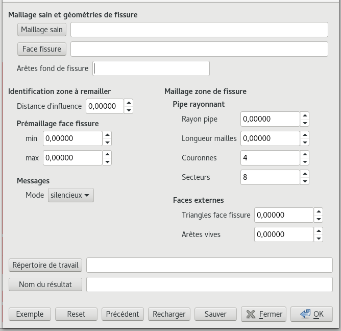
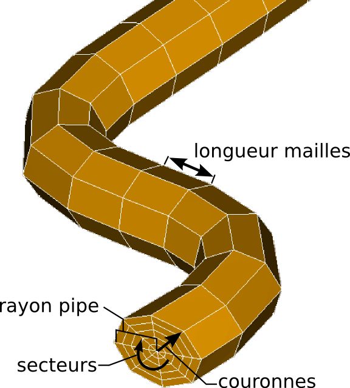

.. _gui:

With GUI
=====================================

To make the use of « Bloc Fissure » easier, a Graphical User Interface (GUI) was developed.
Inputs are similar to those of :ref:`script mode <script>`. GUI is accessible in the SMESH extension *Add a crack in a mesh*

   Windows of the graphical interface

+------------------------------------------------------------------------------------------------------------------+
|       GUI parameters                                                                                             |
+======================+===================================+=======================================================+
| **maillageSain**     | *[string]*                        |  Relative address of the input structure 3D mesh      |
|                      | ex: mesh/maillage.med             |  in MED format (base is repertoire de travail)        |
+----------------------+-----------------------------------+-------------------------------------------------------+
| **FaceFissure**      | *[string]*                        |  Relative address of the input crack geometry         |
|                      | ex: mesh/fissure.brep             |  in BREP format (base is repertoire de travail)       |
+----------------------+-----------------------------------+-------------------------------------------------------+
| **index edges fond   | *[list of integers]*              |  List of edges number which define the crack front    |
| fissure**            | ex: [1,2]                         |                                                       |
+----------------------+-----------------------------------+-------------------------------------------------------+
| **min**              | *[float]*                         |  Float defining the minimum size of elements          |
|                      | ex: 1.00000                       |  to mesh the crack                                    |
+----------------------+-----------------------------------+-------------------------------------------------------+
| **max**              | *[float]*                         |  Float defining the maximum size of elements          |
|                      | ex: 10.0000                       |  to mesh the crack                                    |
+----------------------+-----------------------------------+-------------------------------------------------------+
| **distance           | *[float]*                         |  Length of influence - distance that defines the      |
| influence**          | ex: 20.0000                       |  size of the extracted Box around the crack           |
+----------------------+-----------------------------------+-------------------------------------------------------+
| **rayon pipe**       | *[float]*                         |  Radius of the tore around the front                  |
|                      | ex: 5.00000                       |                                                       |
+----------------------+-----------------------------------+-------------------------------------------------------+
| **longueur mailles** | *[float]*                         |  Length of the segments of the tore along crack front |
|                      | ex: 5.00000                       |                                                       |
+----------------------+-----------------------------------+-------------------------------------------------------+
|  **couronnes**       | *[integer]*                       |  Number of radial segment of the tore                 |
|                      | ex: 5                             |                                                       |
+----------------------+-----------------------------------+-------------------------------------------------------+
| **secteurs**         | *[integer]*                       |  Number of sectors of the tore                        |
|                      | ex: 16                            |                                                       |
+----------------------+-----------------------------------+-------------------------------------------------------+
| **arete face         | *[float]*                         |  Mesh size of elements for the Box remeshing          |
| fissure**            | ex: 5.0000                        |                                                       |
+----------------------+-----------------------------------+-------------------------------------------------------+
| **repertoire de      | *[string]*                        |  Absolute address of the directory where files are    |
| travail**            | ex: /home/A123456                 |  saved                                                |
+----------------------+-----------------------------------+-------------------------------------------------------+
| **nom résultat**     | *[string]*                        |  Name of the resulting mesh                           |
|                      | ex: maillage_fissure              |                                                       |
+----------------------+-----------------------------------+-------------------------------------------------------+
| **mode**             | *[choice]*                        |  Verbose mode for Salome messages                     |
|                      | ex: verbose                       |                                                       |
+----------------------+-----------------------------------+-------------------------------------------------------+

   Tore parameters

- **Reset**: clears all the parameters

- **Précédent**: loads the last set of parameters used

- **Recharger**: loads a .dic file containing parameters

- **Sauver**: save a .dic file with the active parameters

- **Cancel**: exit GUI

- **Sauver**: Launch calculation

