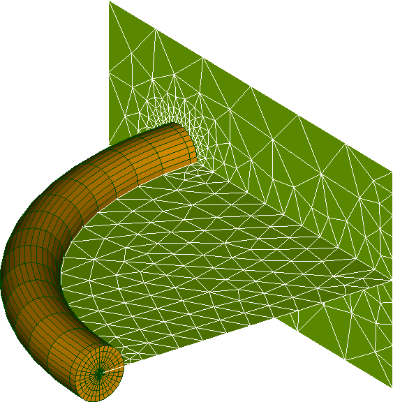

.. _introduction:

###################
Introduction
###################

« Bloc Fissure » is a SMESH extension used to insert cracks in existing meshes. It has the advantage of meshing the crack front and the surrounding elements with a tore containing ruled elements. The rest of the crack contains a free mesh. The tore is made of prism elements (extruded triangles connected to the crack front) and hexahedrons elsewhere. The main interests of such type of mesh are:

- Having sets of Gauss points in plans perpendicular to the crack front in order to calculate stress field without any interpolation, which would be the case on free mesh. It avoids strong oscillations along the crack front on the energy release rate and stress intensity factors calculated by `extrapolation <http://code-aster.org/doc/default/fr/man_r/r7/r7.02.08.pdf>`_ or `G-theta method <http://code-aster.org/doc/default/fr/man_r/r7/r7.02.01.pdf>`_.

- Decrease the element number. In fracture mechanics, a fine mesh is necessary radially to the crack front and more rarely along the front axis. Yet hexahedrons and prisms elements can have geometrical aspect ratios up to 20 without major matrix conditioning problems. On the contrary, tetrahedrons of free meshes are generally limited to aspect ratios around 3. The use of very elongated elements is then no longer a limitation and number of elements can be significantly decreased.

« Bloc Fissure » is not applicable every time. It is highly recommended to read the section on :ref:`general principles <general_principles>` to see how « Bloc Fissure » works. This section also gives the functional scope and the :ref:`limitations <recommendations>` of the tool. Finally, this part deals with cautions that the user must take using « Bloc Fissure ». The user can also refers himself to the :ref:`tutorial <tutorials>` to get some advice on how to make « Bloc Fissure » works.

If « Bloc Fissure » can’t be used on a case, the user may switch to the other FEM insertion tool Zcracks in SALOME (soon available). It’s more robust and has less limitations but the result is a cracked free mesh with tetrahedral elements. Another possibility is the `X-FEM method <http://www.code-aster.org/doc/v11/fr/man_u/u2/u2.05.02.pdf>`_ method in SALOME_MECA.

