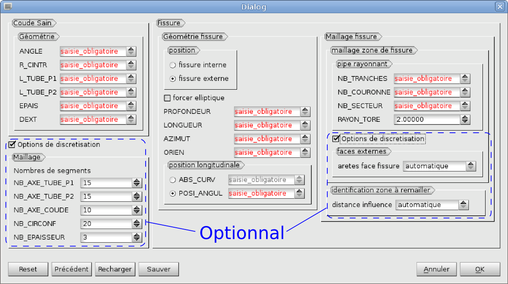

.. _using_bf_bended_pipes:

For bended pipes
=====================================

Cracked bended pipes being a common encountered case, a specific module was developed with a Graphic User Interface (GUI). GUI is accessible in the SMESH extension *Meshed Pipe with a crack*. Compared to the classical use of « Bloc Fissure », this extension also generate the pipe mesh and the crack geometry from geometrical information.

   Print screen of GUI of the extension *Meshed Pipe with a crack*

The GUI is a window with mandatory and optional parameters. Optional parameters have to be activated by ticking the corresponding check box. Parameters are explained on the following figures and table. Angles are in degrees and lengths dimensions are all the same and shall then be consistent with each other’s.

+---------------------------------------+---------------------------------------+
|.. image:: images/schema_tube_sain.png | .. image:: images/schema_fis_ext2.png |
|   :scale: 40                          |    :scale: 40                         |
|   :align: center                      |    :align: center                     |
+---------------------------------------+---------------------------------------+
|.. image:: images/schema_fissure.png                                           |
|   :scale: 40                                                                  |
|   :align: center                                                              |
+---------------------------------------+---------------------------------------+

+-----------------------------------------------------------------------------------------+
|       Section "coude sain"                                                              |
+===================+=====================================================================+
|**ANGLE**          | Bending angle value between 0 and 90°                               |
+-------------------+---------------------------------------------------------------------+
|**R_CINTR**        | Bending radius at the pipe axe                                      |
+-------------------+---------------------------------------------------------------------+
|**L_TUBE_P1**      | P1 nozzle length                                                    |
+-------------------+---------------------------------------------------------------------+
|**L_TUBE_P2**      | P2 nozzle length                                                    |
+-------------------+---------------------------------------------------------------------+
|**EPAIS**          | Pipe thickness                                                      |
+-------------------+---------------------------------------------------------------------+
|**DEXT**           | External diameter of the pipe                                       |
+-------------------+---------------------------------------------------------------------+
|/**NB_AXE_TUBE_P1**| Number of elements along P1 nozzle axe                              |
+-------------------+---------------------------------------------------------------------+
|/**NB_AXE_TUBE_P2**| Number of elements along P2 nozzle axe                              |
+-------------------+---------------------------------------------------------------------+
|/**NB_AXE_COUDE**  | Number of elements along bend axe                                   |
+-------------------+---------------------------------------------------------------------+
|/**NB_CIRCONF**    | Number of elements in the circumference of the pipe (shall be even) |
+-------------------+---------------------------------------------------------------------+
|/**NB_EPAISSEUR**  | Number of elements in the pipe thickness                            |
+-------------------+---------------------------------------------------------------------+

+---------------------------+----------------------------------------------------------------------------------------------+
|         Section "fissure"                                                                                                |
+===========================+==============================================================================================+
|**Fissure interne externe**| Crack position respectively on the internal or external face of the pipe                     |
+---------------------------+----------------------------------------------------------------------------------------------+
|**Forcer elliptique**      | Force the crack to be elliptic (do not use, under development)                               |
+---------------------------+----------------------------------------------------------------------------------------------+
|**PROFONDEUR**             | Crack depth                                                                                  |
+---------------------------+----------------------------------------------------------------------------------------------+
|**LONGUEUR**               | Crack major axis length measured on the surface where the crack is to be inserted            |
+---------------------------+----------------------------------------------------------------------------------------------+
|**AZIMUT**                 | Circumferential position of the crack in degrees from the extrados to the intrados           |
+---------------------------+----------------------------------------------------------------------------------------------+
|**ORIEN**                  | Angle between the major axis of the crack and the axe of the pipe.                           |
+---------------------------+----------------------------------------------------------------------------------------------+
|**ABS_CURV**               | Longitudinal position of the crack centre defined from the interface between P1 and the bend.|
|                           | It’s a curvilinear abscise and it can be negative or positive.                               |
+---------------------------+----------------------------------------------------------------------------------------------+
|Or **POSI_ANGUL**          | Longitudinal position of the crack centre (DO NOT USE)                                       |
+---------------------------+----------------------------------------------------------------------------------------------+

+----------------------------------------------------------------------------+
|       Section "maillage fissure"                                           |
+========================+===================================================+
|**NB_TRANCHES**         | Elements number along the crack front of the tore |
+------------------------+---------------------------------------------------+
|**NB_COURONNE**         | Elements number in the radius of the tore         |
+------------------------+---------------------------------------------------+
|**NB_SECTEUR**          | Sectors number of the tore                        |
+------------------------+---------------------------------------------------+
|**RAYON_TORE**          | Tore radius                                       |
+------------------------+---------------------------------------------------+
|/**Arêtes face fissure**| Approximate size of elements on the external face |
|                        | of the Box mesh after crack insertion             |
+------------------------+---------------------------------------------------+
|/**Distance influence** | Length that defines the criterion to include mesh |
|                        | elements around the crack in the Box or not       |
+------------------------+---------------------------------------------------+

- **Reset**: clears all the parameters

- **Précédent**: loads the last set of parameters used

- **Recharger**: loads a .dic file containing parameters

- **Sauver**: save a .dic file with the active parameters

