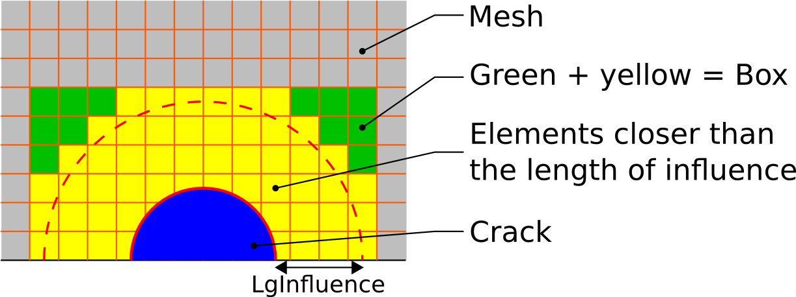
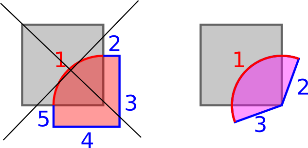

.. _general_principles:

###################
General principles
###################

« Bloc Fissure » is based on GEOM module geometrical Boolean operations. The initial structure being a mesh, a conversion from mesh to geometry becomes necessary. This operation is called extraction and reconstruction because it is only applied to a small part of the mesh, which is around the crack. The extracted mesh is called the « Box » and only external faces of this mesh are kept and converted into several geometrical surfaces. This operation implies some limitations on the input mesh. When all the Booleans operations are done, the geometry that contains the crack is meshed again with a ruled mesh in the tore and a free mesh elsewhere.

In order to illustrate « Bloc Fissure » principle, the simple case of a crack insertion in a parallelepipedic specimen is detailed step by step:

1. The first step consists in loading the structure mesh (a) as well as the crack surface geometry (b).

2. The crack is then meshed (c). A length criterion defines the size of the extracted « Box ». This length is called the length of influence. All elements having a node within this zone is included in the « Box ». A second operation adds elements in the Box in order to have continuous faces (d).

3. A geometrical Box is reconstructed from the extracted Box mesh. The reconstruction is limited to faces which intersect the crack (e). A tore is created following the crack front (f).

4. The geometrical Box is then cut by the tore and the crack (g). Several plans are created in order to partition the box and the tore into radiuses for the future mesh (h).

5. The Box, the crack and the tore are meshed on their external surface (i) and then filled with volumetric elements (j). Crack nodes are doubled to « open » crack lips.

6. Finally the cracked box mesh is reinserted in the initial mesh ensuring the connectivity (k).

+---------------------------------------+---------------------------------------+---------------------------------------+
| .. image:: images/general_princ_a.png | .. image:: images/general_princ_b.png | .. image:: images/general_princ_c.png |
|   :height: 600                        |    :height: 184                       |   :height: 184                        |
|   :align: center                      |    :align: center                     |   :align: center                      |
|                                       |                                       |                                       |
| (a)                                   | (b)                                   | (c)                                   |
+                                       +---------------------------------------+---------------------------------------+
|                                       | .. image:: images/general_princ_d.png | .. image:: images/general_princ_e.png |
|                                       |    :height: 184                       |   :height: 184                        |
|                                       |    :align: center                     |   :align: center                      |
|                                       |                                       |                                       |
|                                       | (d)                                   | (e)                                   |
+                                       +---------------------------------------+---------------------------------------+
|                                       | .. image:: images/general_princ_f.png | .. image:: images/general_princ_g.png |
|                                       |    :height: 184                       |   :height: 184                        |
|                                       |    :align: center                     |   :align: center                      |
|                                       |                                       |                                       |
|                                       | (f)                                   | (g)                                   |
+---------------------------------------+---------------------------------------+---------------------------------------+
| .. image:: images/general_princ_h.png | .. image:: images/general_princ_k.png |                                       |
|   :height: 184                        |    :height: 600                       |                                       |
|   :align: center                      |    :align: center                     |                                       |
|                                       |                                       |                                       |
| (h)                                   | (k)                                   |                                       |
+---------------------------------------+                                       +                                       +
| .. image:: images/general_princ_i.png |                                       |                                       |
|   :height: 184                        |                                       |                                       |
|   :align: center                      |                                       |                                       |
|                                       |                                       |                                       |
| (i)                                   |                                       |                                       |
+---------------------------------------+                                       +                                       +
| .. image:: images/general_princ_j.png |                                       |                                       |
|   :height: 184                        |                                       |                                       |
|   :align: center                      |                                       |                                       |
|                                       |                                       |                                       |
| (j)                                   |                                       |                                       |
+---------------------------------------+---------------------------------------+---------------------------------------+

The length of influence is important. It defines the size of the extracted Box. Here is a 2D example showing how are selected the elements of the Box :

All elements having a node at a smaller distance to the crack than the length of influence is selected. Then a filling algorithm fulfill the Box with elements to get a Box. The Box is not limited to rectangular shapes. See the section on :ref:`test cases <test_cases>` to see examples.

.. _recommendations:

######################################
Recommendations and limitations
######################################

1) **Linear input mesh:**

The input structure mesh must have linear elements in the extracted Box. Elements elsewhere do not have this limitation. The user can easily convert the mesh from quadratic to linear in MESH module in SALOME. Note that the element curvature of quadratic element is lost in the conversion.

2) **Hexahedral mesh:**

The extracted Box must have ruled quadrangles on the external faces which are intersected by the crack. The algorithm for geometrical reconstruction of the box needs 4 nodes elements on the surface of the box mesh. It means that free tetrahedral elements meshes are incompatible with « Bloc Fissure».

3) **Crack shall exceed from the structure:**

Surface crack geometry shall exceed from the structure mesh. Boolean operation can be problematic if crack surface edges are strictly on the Box faces. On the other hand, surface crack shall not exceed too much. A good rule would be to ensure that the area of the crack in the structure is greater than the area of the crack outside of the structure. It also means that internal crack can't be handled.

4) **Crack front edges must exceed from the structure:**

For similar reasons, crack front edges must exceed from the structure mesh. The user shall be really careful when fusing crack front edges within the structure with edges outside of the structure because junction mustn’t be on the box external face. For example the following figure shows the bad and the good practice. In grew a 2D view of a structure to cut and in red the crack surface. Line 1 is the edge declared as the crack front. On the left case, Line 1 stops on the box boundary. Even if Line 1 is extended with Line 2 and 5, « Bloc Fissure» will fail. The good practice is to extend the Line 1 with the same shape. See how to extend the front edges in the :ref:`tutorials section <tutorials>`

5) **Loss of element groups:**

Crack insertion with « Bloc Fissure» doesn’t ensure elements groups conservation. All the groups that are partially or totally in the Box mesh are impacted. Groups are not deleted but newly created elements are not added to the initial groups. Users must be really careful and verify their groups after crack insertion.

+-------------------------------------------+------------------------------------------+
|.. image:: images/recom_groupe_avant.png   | .. image:: images/recom_groupe_apres.png |
|   :height: 400                            |    :height: 400                          |
|   :align: center                          |    :align: center                        |
+-------------------------------------------+------------------------------------------+

In this example, the initial group contains all the external faces of the mesh (left). After insertion, the group still exists but all elements of the Box are not in the group anymore (right).

6) **Loss of interfaces:**

Interfaces between elements are not kept in the Box zone during insertion. For example, in the case of a crack inserted at an interface between two materials, there is no way to rebuild exactly the original groups for affecting materials properties.

+--------------------------------------------+---------------------------------------------+
|.. image:: images/recom_interface_avant.png | .. image:: images/recom_interface_apres.png |
|   :height: 300                             |    :height: 300                             |
|   :align: center                           |    :align: center                           |
+--------------------------------------------+---------------------------------------------+

7) **Element normal:**

Elements normal orientation doesn’t always follow the outgoing rule. User must verify faces orientation if fluxes boundary conditions are to be applied to the mesh.

