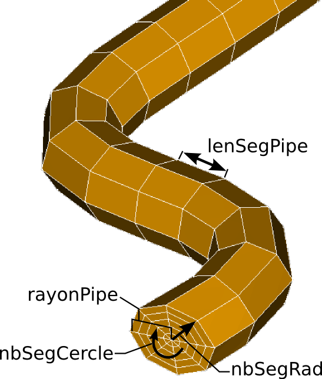

.. _script:

With scripts
=====================================

« Bloc Fissure » has a script mode which is very close to the :ref:`GUI <gui>`, in the sense that the same information is needed as input.This documentation aims at giving an example and explains how to generate a cracked mesh using a python script calling « Bloc Fissure » functions. There are several others functions available in « Bloc Fissure » but they are not documented in this documentation.

The main command of « Bloc Fissure » is the casStandard function. It has a single argument which is a python dictionary with the following keys. All are mandatory parameters except those marked by /.

+------------------------------------------------------------------------------------------------------------------+
|       Script parameters                                                                                          |
+======================+===================================+=======================================================+
| / **nomCas**         | *[string, default=’casStandard’]* |  Name of the problem                                  |
+----------------------+-----------------------------------+-------------------------------------------------------+
| **maillageSain**     | *[string]*                        |  Absolute address of the input structure 3D mesh      |
|                      |                                   |  in MED format                                        |
+----------------------+-----------------------------------+-------------------------------------------------------+
| **BrepFaceFissure**  | *[string]*                        |  Absolute address of the input crack geometry         |
|                      |                                   |  in BREP format                                       |
+----------------------+-----------------------------------+-------------------------------------------------------+
| **edgeFissIds**      | *[list of integers]*              |  List of edges number which define the crack front    |
+----------------------+-----------------------------------+-------------------------------------------------------+
| **meshBrep**         | *[list of 2 floats]*              |  List of two floats defining respectively minimum and |
|                      |                                   |  maximum size of elements of the crack mesh           |
+----------------------+-----------------------------------+-------------------------------------------------------+
| **lgInfluence**      | *[float]*                         |  Length of influence - distance that defines the      |
|                      |                                   |  size of the extracted Box around the crack           |
+----------------------+-----------------------------------+-------------------------------------------------------+
| **rayonPipe**        | *[float]*                         |  Radius of the tore around the front                  |
|                      |                                   |                                                       |
+----------------------+-----------------------------------+-------------------------------------------------------+
| / **lenSegPipe**     | *[float, default=rayonPipe]*      |  Length of the segments of the tore along crack front |
|                      |                                   |                                                       |
+----------------------+-----------------------------------+-------------------------------------------------------+
|  **nbSegRad**        | *[integer]*                       |  Number of radial segment of the tore                 |
|                      |                                   |                                                       |
+----------------------+-----------------------------------+-------------------------------------------------------+
| **nbSegCercle**      | *[integer]*                       |  Number of sectors of the tore                        |
|                      |                                   |                                                       |
+----------------------+-----------------------------------+-------------------------------------------------------+
| **areteFaceFissure** | *[float]*                         |  Mesh size of elements for the Box remeshing          |
|                      |                                   |                                                       |
+----------------------+-----------------------------------+-------------------------------------------------------+

Geometrical parameters of the tore are illustrated :

Different levels of verbose are available. Use one of this 4 optional functions to set verbose type:

- / **setDebug()**

- / **setVerbose()**

- / **setRelease()**

- / **setUnitTests()**

**example to run in salome session**::

  from blocFissure import gmu
  from blocFissure.gmu import initLog
  initLog.setDebug()

  from blocFissure.casStandard import casStandard

  dicoParams = dict(nomCas            = 'cubeFiss',
                    maillageSain      = "/home/A123456/BF/cube.med",
                    brepFaceFissure   = "/home/A123456/BF/fiss.brep",
                    edgeFissIds       = [4],
                    lgInfluence       = 20.,
                    meshBrep          = (5.,10.),
                    rayonPipe         = 5.,
                    lenSegPipe        = 5,
                    nbSegRad          = 5,
                    nbSegCercle       = 32,
                    areteFaceFissure  = 5)

  execInstance = casStandard(dicoParams)

